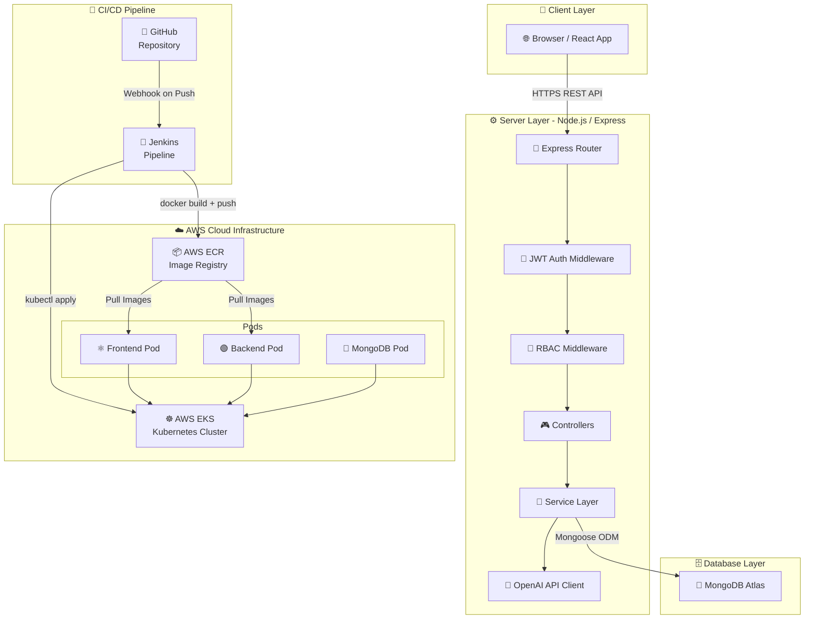
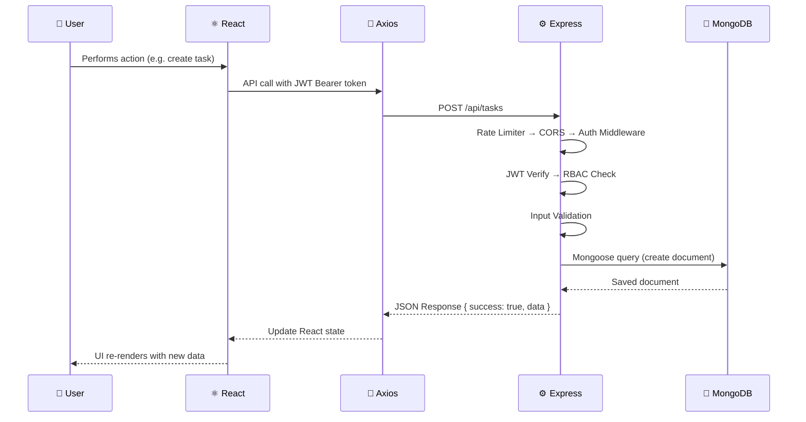
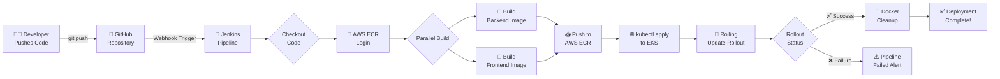
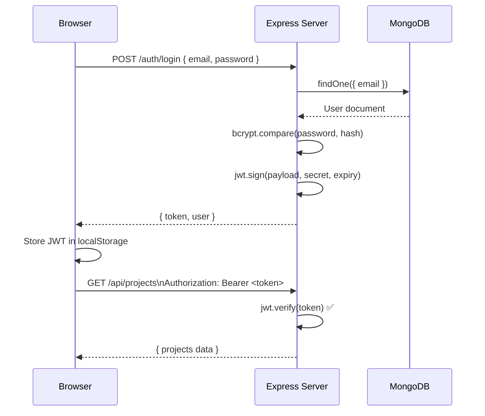
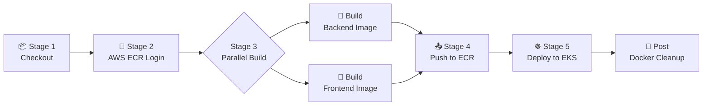

<div align="center">

# 🚀 JiraClone — Enterprise Project Management & DevOps Platform

### A production-grade Full Stack MERN application with complete DevOps pipeline

[](https://github.com/swarajvecha-web/Project-Management)
[](https://reactjs.org/)
[](https://nodejs.org/)
[](https://expressjs.com/)
[](https://www.mongodb.com/)
[](https://www.docker.com/)
[](https://kubernetes.io/)
[](https://aws.amazon.com/)
[](https://www.terraform.io/)
[](https://www.jenkins.io/)
[](https://tailwindcss.com/)
[](https://openai.com/)
[](https://jwt.io/)
[](LICENSE)
[](CONTRIBUTING.md)

**[Live Demo](#-live-demo) • [Features](#-features) • [Tech Stack](#️-tech-stack) • [Quick Start](#-quick-start) • [DevOps Pipeline](#-devops-pipeline) • [API Docs](#-api-endpoints)**

</div>

---

## 📋 Table of Contents

- [Project Description](#-project-description)
- [Features](#-features)
- [Tech Stack](#️-tech-stack)
- [Architecture Overview](#️-architecture-overview)
- [Folder Structure](#-folder-structure)
- [Prerequisites](#-prerequisites)
- [Installation & Quick Start](#-quick-start)
- [Environment Variables](#-environment-variables)
- [Docker Setup](#-docker-setup)
- [CI/CD Pipeline](#-cicd-pipeline)
- [Jenkins Configuration](#️-jenkins-configuration)
- [Kubernetes Deployment](#-kubernetes-deployment)
- [API Endpoints](#-api-endpoints)
- [Usage Instructions](#-usage-instructions)
- [Deployment Process](#-deployment-process)
- [Screenshots](#-screenshots)
- [Future Enhancements](#-future-enhancements)
- [Contributing Guidelines](#-contributing-guidelines)
- [License](#-license)
- [Author](#-author)

---

## 📖 Project Description

**JiraClone** is a **production-grade, full-stack MERN application** — a Jira-inspired enterprise platform engineered for real engineering teams, HR departments, and product managers. It goes far beyond basic task management by unifying agile project workflows, AI-powered task generation, employee attendance tracking, timesheet management, burndown analytics, and a complete DevOps pipeline under one roof.

> **This is not a tutorial project.** It is a complete, deployable SaaS-grade platform built to enterprise documentation, security, and scalability standards — with a fully automated DevOps pipeline from local development to AWS EKS production deployment.

### 🌍 What makes this special?

- **Full-stack depth** — Clean MERN architecture with proper separation of concerns, service layers, RBAC, and JWT security
- **AI Integration** — Real OpenAI GPT API usage for intelligent Agile task generation
- **Enterprise DevOps** — Dockerized services → Jenkins CI/CD → AWS ECR → Kubernetes on AWS EKS → Terraform IaC
- **HR + Project Management** — Attendance and timesheet modules not typically found in project management tools
- **Portfolio-ready** — End-to-end documentation, architecture diagrams, and recruiter-friendly presentation

---

## ✨ Features

### 🗂️ Project & Agile Management
- ✅ Create and manage multiple projects (Scrum, Kanban, Business types)
- ✅ **Kanban Board** — drag-and-drop task cards across columns (To Do → In Progress → In Review → Done)
- ✅ **Sprint Planning** — create, start, and complete time-boxed sprints
- ✅ **Backlog Management** — prioritized backlog with drag-to-sprint promotion
- ✅ **Roadmap View** — visual timeline of sprints and epics
- ✅ **Burndown Charts** — real-time sprint burndown analytics

### 📋 Task Management
- ✅ Full task lifecycle: Story, Bug, Task, Epic, Sub-task
- ✅ Priority levels: Critical, High, Medium, Low
- ✅ Status workflows with transitions and validation
- ✅ Task assignment, due dates, story points, labels, and file attachments

### 👥 Employee & HR Management
- ✅ Employee directory with profile management
- ✅ Department and designation management
- ✅ **One-click Check-In / Check-Out** attendance system
- ✅ Daily, weekly, and monthly attendance reports
- ✅ **Timesheet logging** with project/task association and manager approval workflow

### 🤖 AI-Powered Features
- ✅ **AI Suggest** — Generate professional task titles, descriptions, and acceptance criteria via OpenAI GPT
- ✅ Context-aware suggestions based on project type and sprint goal
- ✅ Given/When/Then acceptance criteria in Agile format

### 💬 Collaboration
- ✅ Threaded comment system with @mention support
- ✅ Real-time in-app notification system
- ✅ Activity feed per task and project

### 🔐 Security
- ✅ JWT authentication with refresh tokens
- ✅ Role-Based Access Control (Admin, Manager, Developer, Viewer)
- ✅ bcrypt password hashing, Helmet security headers, rate limiting

### ⚙️ DevOps & Infrastructure
- ✅ **Dockerized** — multi-container local stack with Docker Compose
- ✅ **Jenkins CI/CD** — automated build, push, and deploy pipeline
- ✅ **AWS ECR** — container image registry
- ✅ **Kubernetes on AWS EKS** — production deployment with rolling updates
- ✅ **Terraform** — Infrastructure as Code for AWS resource provisioning

---

## 🛠️ Tech Stack

### Frontend
| Technology | Version | Purpose |
|---|---|---|
| React.js | 18.x | UI framework |
| React Router DOM | 6.x | Client-side routing |
| Tailwind CSS | 3.x | Utility-first styling |
| Axios | 1.x | HTTP client with interceptors |
| React Context API | — | Global state management |
| React Hook Form | 7.x | Form state & validation |
| Recharts / Chart.js | — | Burndown & analytics charts |
| dnd-kit | — | Drag-and-drop Kanban board |
| Lucide React | — | Icon library |

### Backend
| Technology | Version | Purpose |
|---|---|---|
| Node.js | 18.x LTS | JavaScript runtime |
| Express.js | 4.x | REST API framework |
| MongoDB | 6.x | NoSQL database |
| Mongoose | 7.x | ODM for MongoDB |
| JWT (jsonwebtoken) | 9.x | Authentication tokens |
| bcryptjs | 2.x | Password hashing |
| OpenAI SDK | 4.x | AI task generation |
| Helmet | — | Security HTTP headers |
| Express Rate Limit | — | API rate limiting |
| Morgan | — | HTTP request logging |

### Database
| Technology | Purpose |
|---|---|
| MongoDB | Primary NoSQL database |
| MongoDB Atlas | Cloud-hosted production database |
| Mongoose ODM | Schema modeling, validation, indexing |

### DevOps Tools
| Tool | Purpose |
|---|---|
| Docker & Docker Compose | Containerization & local dev stack |
| Jenkins | CI/CD pipeline automation |
| AWS ECR | Docker image registry |
| AWS EKS | Managed Kubernetes cluster |
| Kubernetes | Container orchestration |
| Terraform (HCL) | Infrastructure as Code |
| GitHub | Version control & webhook triggers |

---

## 🏗️ Architecture Overview

### System Architecture



### Request Lifecycle



### DevOps Pipeline Flow



### Authentication Flow



---

## 📁 Folder Structure

```
Project-Management/
├── 📂 backend/                    # Node.js / Express REST API
│   ├── 📂 config/
│   │   ├── db.js                  # MongoDB connection
│   │   └── openai.js              # OpenAI client config
│   ├── 📂 controllers/            # Request handlers
│   │   ├── authController.js
│   │   ├── projectController.js
│   │   ├── taskController.js
│   │   ├── sprintController.js
│   │   ├── attendanceController.js
│   │   ├── timesheetController.js
│   │   └── aiController.js
│   ├── 📂 middleware/
│   │   ├── authMiddleware.js      # JWT verification
│   │   ├── roleMiddleware.js      # RBAC enforcement
│   │   ├── rateLimiter.js         # Rate limiting
│   │   └── errorHandler.js        # Global error handler
│   ├── 📂 models/                 # Mongoose schemas
│   │   ├── User.js
│   │   ├── Project.js
│   │   ├── Task.js
│   │   ├── Sprint.js
│   │   ├── Attendance.js
│   │   ├── Timesheet.js
│   │   └── Comment.js
│   ├── 📂 routes/                 # Express routers
│   │   ├── authRoutes.js
│   │   ├── projectRoutes.js
│   │   ├── taskRoutes.js
│   │   ├── sprintRoutes.js
│   │   ├── attendanceRoutes.js
│   │   └── aiRoutes.js
│   ├── 📂 services/               # Business logic layer
│   ├── app.js                     # Express app setup
│   ├── Dockerfile                 # Backend container image
│   └── package.json
│
├── 📂 frontend/                   # React.js Application
│   ├── 📂 public/
│   ├── 📂 src/
│   │   ├── 📂 components/         # Reusable UI components
│   │   │   ├── board/             # KanbanBoard, TaskCard
│   │   │   ├── sprint/            # SprintCard, BurndownChart
│   │   │   ├── attendance/        # AttendanceTable, CheckInButton
│   │   │   ├── timesheet/         # TimesheetForm, TimesheetList
│   │   │   └── ai/                # AISuggestModal
│   │   ├── 📂 context/            # React Context providers
│   │   │   ├── AuthContext.jsx
│   │   │   └── ProjectContext.jsx
│   │   ├── 📂 hooks/              # Custom React hooks
│   │   ├── 📂 pages/              # Route-level components
│   │   │   ├── Dashboard/
│   │   │   ├── Projects/
│   │   │   ├── Board/
│   │   │   ├── Backlog/
│   │   │   ├── Attendance/
│   │   │   └── Analytics/
│   │   ├── 📂 services/           # Axios API service layer
│   │   └── 📂 utils/              # Helpers and formatters
│   ├── Dockerfile                 # Frontend container image
│   └── package.json
│
├── 📂 k8s/                        # Kubernetes manifests
│   ├── 📂 backend/
│   │   ├── deployment.yaml
│   │   └── service.yaml
│   ├── 📂 frontend/
│   │   ├── deployment.yaml
│   │   └── service.yaml
│   ├── 📂 mongo/
│   │   ├── deployment.yaml
│   │   └── service.yaml
│   └── ingress.yaml               # NGINX Ingress Controller
│
├── 📂 terraform/                  # Infrastructure as Code
│   ├── main.tf                    # AWS EKS, ECR, VPC provisioning
│   ├── variables.tf
│   └── outputs.tf
│
├── 🐳 docker-compose.yml          # Local dev multi-container stack
├── ⚙️  Jenkinsfile                # Declarative Jenkins CI/CD pipeline
├── .gitignore
└── README.md
```

---

## 📋 Prerequisites

Ensure the following are installed before proceeding:

```bash
node --version        # v18.x or higher
npm --version         # v9.x or higher
docker --version      # Docker Desktop / Engine
docker compose version  # v2.x or higher
git --version         # Any recent version
```

For DevOps pipeline:
```bash
aws --version         # AWS CLI v2
kubectl version       # kubectl (for Kubernetes)
terraform --version   # Terraform v1.x (for IaC)
```

---

## ⚡ Quick Start

### 1. Clone the Repository

```bash
git clone https://github.com/swarajvecha-web/Project-Management.git
cd Project-Management
```

### 2. Install Dependencies

```bash
# Backend dependencies
cd backend
npm install

# Frontend dependencies
cd ../frontend
npm install
```

### 3. Configure Environment Variables

```bash
cp backend/.env.example backend/.env
cp frontend/.env.example frontend/.env
# Edit both files with your actual values (see Environment Variables section)
```

### 4. Start Development Servers

```bash
# Terminal 1 — Backend (from /backend)
cd backend && npm run dev
# ✅ Server running on http://localhost:8000

# Terminal 2 — Frontend (from /frontend)
cd frontend && npm start
# ✅ App running on http://localhost:3000
```

### 5. Build for Production

```bash
cd frontend && npm run build
cd backend && NODE_ENV=production npm start
```

---

## 🔑 Environment Variables

### Backend — `backend/.env`

```env
# ─── Server ───────────────────────────────────────────────────
NODE_ENV=development
PORT=8000

# ─── MongoDB ──────────────────────────────────────────────────
MONGODB_URI=mongodb+srv://<username>:<password>@cluster0.xxxx.mongodb.net/jiraclone?retryWrites=true&w=majority
# For local Docker: mongodb://mongo:27017/jiraclone

# ─── JWT Authentication ───────────────────────────────────────
JWT_SECRET=your_super_secure_jwt_secret_minimum_32_characters
JWT_EXPIRES_IN=1d
JWT_REFRESH_SECRET=your_refresh_token_secret_key
JWT_REFRESH_EXPIRES_IN=7d

# ─── OpenAI API ───────────────────────────────────────────────
OPENAI_API_KEY=sk-proj-xxxxxxxxxxxxxxxxxxxxxxxxxxxxxxxxxxxx
OPENAI_MODEL=gpt-3.5-turbo
OPENAI_MAX_TOKENS=500

# ─── CORS ─────────────────────────────────────────────────────
CLIENT_URL=http://localhost:3000

# ─── Rate Limiting ────────────────────────────────────────────
RATE_LIMIT_WINDOW_MS=900000
RATE_LIMIT_MAX=100
AI_RATE_LIMIT_MAX=5
```

### Frontend — `frontend/.env`

```env
# ─── Backend API URL ──────────────────────────────────────────
REACT_APP_API_URL=http://localhost:8000
# For Docker Compose: http://localhost:8000
# For production: https://your-backend-domain.com

# ─── App Info ─────────────────────────────────────────────────
REACT_APP_NAME=JiraClone
REACT_APP_VERSION=1.0.0
```

> ⚠️ **NEVER commit `.env` files to version control.** Both are listed in `.gitignore`.

---

## 🐳 Docker Setup

The project ships with a complete **Docker Compose** stack that spins up MongoDB, the Express backend (with nodemon hot-reload), and the React frontend in one command.

### Services

| Service | Container | Port | Description |
|---|---|---|---|
| 🍃 MongoDB | `jiraclone_mongo` | 27017 | MongoDB 6 with persistent volume |
| ⚙️ Backend | `jiraclone_backend` | 8000 | Express API with nodemon hot-reload |
| ⚛️ Frontend | `jiraclone_frontend` | 3000 | React dev server |

### Start the Full Stack

```bash
# Build and start all services
docker compose up --build

# Start in detached (background) mode
docker compose up --build -d

# View logs
docker compose logs -f

# Stop all services
docker compose down

# Stop and remove volumes (⚠️ deletes DB data)
docker compose down -v
```

### Access the Application

```
Frontend:   http://localhost:3000
Backend API: http://localhost:8000
MongoDB:    mongodb://localhost:27017/jiraclone  (for Compass/Studio 3T)
```

### docker-compose.yml Overview

```yaml
services:
  mongo:
    image: mongo:6
    volumes:
      - mongo_data:/data/db    # Persistent named volume
    healthcheck:               # Backend waits for healthy DB

  backend:
    build: ./backend
    ports: ["8000:8000"]
    environment:
      MONGODB_URI: mongodb://mongo:27017/jiraclone
    depends_on:
      mongo:
        condition: service_healthy
    command: ["./node_modules/.bin/nodemon", "app.js"]  # Hot-reload

  frontend:
    build: ./frontend
    ports: ["3000:3000"]
    environment:
      REACT_APP_API_URL: http://localhost:8000
    depends_on: [backend]
```

---

## 🔄 CI/CD Pipeline

The project includes a fully automated **Jenkins Declarative Pipeline** that handles the entire flow from code commit to Kubernetes production deployment.

### Pipeline Stages



### Trigger

The pipeline fires **automatically** on every `git push` to the `main` branch via a **GitHub Webhook**.

### Image Tagging Strategy

Each image is tagged with both `BUILD_NUMBER-GIT_SHORT_SHA` for traceability and `:latest` for Kubernetes rollout:

```
385105852446.dkr.ecr.us-east-1.amazonaws.com/jiraclone-backend:42-a1b2c3d
385105852446.dkr.ecr.us-east-1.amazonaws.com/jiraclone-backend:latest
```

---

## ⚙️ Jenkins Configuration

### Prerequisites

- Jenkins server with Docker installed on the agent
- AWS CLI installed on the Jenkins agent
- kubectl installed on the Jenkins agent

### Required Jenkins Credentials

Configure these in **Jenkins → Manage Jenkins → Credentials → System → Global**:

| Credential ID | Type | Description |
|---|---|---|
| `aws-access-key-id` | Secret Text | AWS Access Key ID |
| `aws-secret-access-key` | Secret Text | AWS Secret Access Key |

### Required Jenkins Plugins

```
✅ Pipeline
✅ Docker Pipeline
✅ Credentials Binding (built-in)
✅ GitHub Integration (for webhook trigger)
```

### Pipeline Environment Variables

The `Jenkinsfile` defines all config at the top-level `environment` block:

```groovy
environment {
    AWS_REGION       = 'us-east-1'
    AWS_ACCOUNT_ID   = '385105852446'
    EKS_CLUSTER_NAME = 'jiraclone-cluster'
    K8S_NAMESPACE    = 'jiraclone'
    ECR_REGISTRY     = "${AWS_ACCOUNT_ID}.dkr.ecr.${AWS_REGION}.amazonaws.com"
    IMAGE_BACKEND    = "${ECR_REGISTRY}/jiraclone-backend"
    IMAGE_FRONTEND   = "${ECR_REGISTRY}/jiraclone-frontend"
    IMAGE_TAG        = "${BUILD_NUMBER}-${GIT_SHORT_SHA}"
}
```

### Setting Up the Jenkins Job

```bash
# 1. In Jenkins, click "New Item" → "Pipeline"
# 2. Under "Pipeline", select "Pipeline script from SCM"
# 3. Set SCM: Git → Repository URL: https://github.com/swarajvecha-web/Project-Management.git
# 4. Set Branch: */main
# 5. Script Path: Jenkinsfile
# 6. Under "Build Triggers" → check "GitHub hook trigger for GITScm polling"
# 7. Save
```

### GitHub Webhook Setup

```
GitHub Repo → Settings → Webhooks → Add webhook
Payload URL: http://<JENKINS_IP>:8080/github-webhook/
Content type: application/json
Events: Push events
```

---

## ☸️ Kubernetes Deployment

The `k8s/` directory contains all Kubernetes manifests for deploying to AWS EKS.

### Cluster Setup

```bash
# 1. Provision EKS cluster via Terraform (see terraform/ folder)
cd terraform
terraform init
terraform plan
terraform apply

# 2. Configure kubectl to use the EKS cluster
aws eks update-kubeconfig \
  --region us-east-1 \
  --name jiraclone-cluster

# 3. Verify cluster access
kubectl get nodes
```

### Create Namespace

```bash
kubectl create namespace jiraclone
```

### Deploy Application

```bash
# Deploy MongoDB StatefulSet
kubectl apply -f k8s/mongo/ -n jiraclone

# Deploy Backend
kubectl apply -f k8s/backend/ -n jiraclone

# Deploy Frontend
kubectl apply -f k8s/frontend/ -n jiraclone

# Deploy Ingress
kubectl apply -f k8s/ingress.yaml -n jiraclone
```

### Verify Deployment

```bash
# Check all pods are running
kubectl get pods -n jiraclone

# Check services and their external IPs
kubectl get services -n jiraclone

# Check ingress
kubectl get ingress -n jiraclone

# View backend logs
kubectl logs -f deployment/jiraclone-backend -n jiraclone

# Check rollout status
kubectl rollout status deployment/jiraclone-backend -n jiraclone
kubectl rollout status deployment/jiraclone-frontend -n jiraclone
```

### Manual Rolling Update (without Jenkins)

```bash
# Trigger rolling restart (pulls latest image from ECR)
kubectl rollout restart deployment/jiraclone-backend -n jiraclone
kubectl rollout restart deployment/jiraclone-frontend -n jiraclone

# Rollback to previous version if needed
kubectl rollout undo deployment/jiraclone-backend -n jiraclone
```

### Terraform Infrastructure (AWS)

```bash
cd terraform

# Initialize providers
terraform init

# Preview infrastructure changes
terraform plan -out=tfplan

# Apply — provisions EKS cluster, ECR repos, VPC, IAM roles
terraform apply tfplan

# Destroy all infrastructure
terraform destroy
```

---

## 📡 API Endpoints

**Base URL:** `http://localhost:8000/api`  
**Auth Header:** `Authorization: Bearer <JWT_TOKEN>`

### 🔐 Authentication

| Method | Endpoint | Auth | Description |
|---|---|---|---|
| POST | `/auth/register` | ❌ | Register a new user |
| POST | `/auth/login` | ❌ | Login and receive JWT |
| GET | `/auth/me` | ✅ | Get current user profile |
| POST | `/auth/logout` | ✅ | Logout and invalidate token |

**Register:**
```bash
POST /api/auth/register
Content-Type: application/json

{
  "name": "Jane Doe",
  "email": "jane@example.com",
  "password": "SecurePass123!",
  "role": "developer"
}
```

**Response:**
```json
{
  "success": true,
  "data": {
    "token": "eyJhbGciOiJIUzI1NiIs...",
    "user": { "_id": "...", "name": "Jane Doe", "role": "developer" }
  }
}
```

---

### 📁 Projects

| Method | Endpoint | Auth | Description |
|---|---|---|---|
| GET | `/projects` | ✅ | Get all user's projects |
| POST | `/projects` | ✅ Manager+ | Create new project |
| GET | `/projects/:id` | ✅ | Get project by ID |
| PUT | `/projects/:id` | ✅ Manager+ | Update project |
| DELETE | `/projects/:id` | ✅ Admin | Delete project |
| POST | `/projects/:id/members` | ✅ Manager+ | Add member to project |

---

### ✅ Tasks

| Method | Endpoint | Auth | Description |
|---|---|---|---|
| GET | `/tasks?project=:id` | ✅ | Get tasks by project |
| POST | `/tasks` | ✅ | Create task |
| GET | `/tasks/:id` | ✅ | Get task by ID |
| PUT | `/tasks/:id` | ✅ | Update task |
| DELETE | `/tasks/:id` | ✅ Manager+ | Delete task |
| PATCH | `/tasks/:id/status` | ✅ | Update task status |
| PATCH | `/tasks/:id/assign` | ✅ Manager+ | Assign task to user |

---

### 🏃 Sprints

| Method | Endpoint | Auth | Description |
|---|---|---|---|
| GET | `/sprints?project=:id` | ✅ | Get sprints by project |
| POST | `/sprints` | ✅ Manager+ | Create sprint |
| PATCH | `/sprints/:id/start` | ✅ Manager+ | Start a sprint |
| PATCH | `/sprints/:id/complete` | ✅ Manager+ | Complete a sprint |
| GET | `/sprints/:id/burndown` | ✅ | Get burndown chart data |

---

### ⏱️ Attendance

| Method | Endpoint | Auth | Description |
|---|---|---|---|
| POST | `/attendance/checkin` | ✅ | Mark check-in |
| PATCH | `/attendance/checkout` | ✅ | Mark check-out |
| GET | `/attendance` | ✅ | Get own attendance history |
| GET | `/attendance/all` | ✅ Manager+ | Get all employees' attendance |
| GET | `/attendance/report` | ✅ Manager+ | Generate attendance report |

---

### 🤖 AI Suggest

| Method | Endpoint | Auth | Description |
|---|---|---|---|
| POST | `/ai/suggest` | ✅ | Generate AI task description |

```bash
POST /api/ai/suggest
Authorization: Bearer <token>

{
  "context": "User authentication with Google OAuth",
  "type": "story",
  "projectType": "scrum"
}
```

**Response:**
```json
{
  "success": true,
  "data": {
    "title": "As a user, I want to sign in with Google...",
    "description": "Background: Users prefer social login...",
    "acceptanceCriteria": "Given I am on the login page\nWhen I click 'Continue with Google'\nThen...",
    "aiGenerated": true
  }
}
```

---

### Standard Error Format

```json
{
  "success": false,
  "message": "Human-readable error message",
  "error": "ERROR_CODE",
  "details": [{ "field": "email", "message": "Invalid email format" }]
}
```

| Code | Meaning |
|---|---|
| 200 | Success |
| 201 | Resource created |
| 400 | Validation error |
| 401 | Unauthorized |
| 403 | Forbidden (insufficient role) |
| 429 | Rate limited |
| 500 | Server error |

---

## 🎯 Usage Instructions

### First-Time Setup

```bash
# 1. Register the first admin user
POST /api/auth/register
{ "name": "Admin", "email": "admin@company.com", "password": "...", "role": "admin" }

# 2. Promote to admin in MongoDB (if needed)
db.users.updateOne({ email: "admin@company.com" }, { $set: { role: "admin" } })
```

### Typical Developer Workflow

1. **Login** → receive JWT token stored in localStorage
2. **Create a Project** → set name, key (e.g. "PROJ"), type, and dates
3. **Add Team Members** → invite via email with role assignment
4. **Create Tasks in Backlog** → optionally use ✨ AI Suggest to generate descriptions
5. **Plan a Sprint** → drag tasks from backlog → create sprint → start it
6. **Work on Board** → drag task cards across columns as work progresses
7. **Log Time** → submit timesheet entries per task per day
8. **Mark Attendance** → one-click Check-In at day start, Check-Out at end
9. **Complete Sprint** → review velocity, view burndown chart
10. **View Analytics** → executive dashboard with KPIs and team metrics

### Role-Based Access

| Action | Admin | Manager | Developer | Viewer |
|---|---|---|---|---|
| Create Project | ✅ | ✅ | ❌ | ❌ |
| Delete Project | ✅ | ❌ | ❌ | ❌ |
| Manage Sprint | ✅ | ✅ | ❌ | ❌ |
| Create/Edit Task | ✅ | ✅ | ✅ | ❌ |
| Manage Employees | ✅ | ✅ | ❌ | ❌ |
| Approve Timesheet | ✅ | ✅ | ❌ | ❌ |
| Mark Attendance | ✅ | ✅ | ✅ | ✅ |
| Use AI Suggest | ✅ | ✅ | ✅ | ❌ |
| View Analytics | ✅ | ✅ | ✅ | ✅ |

---

## 🚀 Deployment Process

### Full DevOps Flow: Dev → Production

```
Local Development
      │  git push origin main
      ▼
GitHub Repository
      │  Webhook trigger
      ▼
Jenkins CI/CD Pipeline
  ├── Checkout code
  ├── AWS ECR Login
  ├── Build Docker images (parallel)
  ├── Push to AWS ECR
  └── Deploy to AWS EKS
           │  kubectl apply + rollout restart
           ▼
      AWS EKS Cluster
  ├── jiraclone-frontend pod(s)
  ├── jiraclone-backend pod(s)
  └── MongoDB pod(s)
           │
           ▼
  NGINX Ingress → Public URL
```

### Manual Deployment (without Jenkins)

```bash
# 1. Build images
docker build -t jiraclone-backend:latest ./backend
docker build -t jiraclone-frontend:latest ./frontend

# 2. Tag and push to ECR
aws ecr get-login-password --region us-east-1 | \
  docker login --username AWS --password-stdin \
  385105852446.dkr.ecr.us-east-1.amazonaws.com

docker tag jiraclone-backend:latest \
  385105852446.dkr.ecr.us-east-1.amazonaws.com/jiraclone-backend:latest
docker push \
  385105852446.dkr.ecr.us-east-1.amazonaws.com/jiraclone-backend:latest

# 3. Update EKS
aws eks update-kubeconfig --region us-east-1 --name jiraclone-cluster
kubectl rollout restart deployment/jiraclone-backend -n jiraclone
kubectl rollout restart deployment/jiraclone-frontend -n jiraclone
```

### Alternative Deployment Options

**Frontend → Vercel:**
```bash
npm install -g vercel
cd frontend && vercel --prod
```

**Backend → Render:**
- Root directory: `backend`
- Build command: `npm install`
- Start command: `node app.js`

---

## 📸 Screenshots

> Replace placeholders below with actual screenshots from your deployed application.

| Page | Preview |
|---|---|
| 🔐 Login Page | `` |
| 📊 Dashboard | `` |
| 🗂️ Agile Kanban Board | `` |
| 📁 Projects List | `` |
| ✅ Task Detail View | `` |
| 🤖 AI Suggest Modal | `` |
| ⏰ Attendance Tracker | `` |
| 📝 Timesheet | `` |
| 👥 Employees | `` |
| 📈 Analytics Dashboard | `` |
| ⚙️ Jenkins Pipeline | `` |
| ☸️ Kubernetes Pods | `` |

---

## 🔮 Future Enhancements

| Feature | Priority | Description |
|---|---|---|
| 🔴 Real-time collaboration | High | WebSocket (Socket.io) for live board updates across users |
| 🔴 Email notifications | High | Nodemailer + templates for task assignment and approval alerts |
| 🟡 File uploads (S3) | Medium | AWS S3 / Cloudinary for task attachment storage |
| 🟡 GitHub / GitLab integration | Medium | Link commits and PRs to Jira tasks |
| 🟡 Slack integration | Medium | Post sprint updates and @mentions to Slack channels |
| 🟡 AI sprint planning | Medium | Auto-suggest tasks based on sprint goal using GPT |
| 🟡 2FA (TOTP) | Medium | Time-based one-time password two-factor auth |
| 🟢 PDF/CSV export | Low | Reports exportable as PDF or spreadsheet |
| 🟢 Dark/Light mode toggle | Low | User-selectable theme preference |
| 🟢 Mobile app | Low | React Native companion app |
| 🟢 Full test suite | Low | Jest + Cypress E2E coverage |

---

## 🤝 Contributing Guidelines

Contributions are welcome! Please follow these steps:

### Getting Started

```bash
# 1. Fork the repository
# 2. Clone your fork
git clone https://github.com/YOUR_USERNAME/Project-Management.git

# 3. Create a feature branch
git checkout -b feat/your-feature-name

# 4. Make changes and commit using Conventional Commits
git commit -m "feat(tasks): add AI-powered description generation"

# 5. Push and open a Pull Request
git push origin feat/your-feature-name
```

### Branch Naming Conventions

| Prefix | Use Case | Example |
|---|---|---|
| `feat/` | New feature | `feat/slack-integration` |
| `fix/` | Bug fix | `fix/attendance-checkout-bug` |
| `docs/` | Documentation | `docs/api-endpoints` |
| `refactor/` | Code refactoring | `refactor/task-controller` |
| `chore/` | Dependencies, config | `chore/upgrade-mongoose` |

### Commit Message Format (Conventional Commits)

```
<type>(<scope>): <short description>

Examples:
feat(tasks): add AI-powered description generation
fix(auth): resolve JWT expiry not being checked on refresh
docs(readme): add Kubernetes deployment section
refactor(attendance): extract check-in logic to service layer
```

### Code Style

- **Formatting:** Prettier (default config)
- **Linting:** ESLint with `eslint-config-react-app`
- **Naming:** camelCase for variables/functions, PascalCase for React components
- **API:** RESTful naming with plural nouns for collections

### PR Checklist

- [ ] Branch is up to date with `main`
- [ ] No `console.log` statements in production code
- [ ] API changes documented in the PR description
- [ ] Self-reviewed the diff before submitting

---

## 📄 License

This project is licensed under the **MIT License**.

```
MIT License

Copyright (c) 2024 Swaraj Vecha

Permission is hereby granted, free of charge, to any person obtaining a copy
of this software and associated documentation files (the "Software"), to deal
in the Software without restriction, including without limitation the rights
to use, copy, modify, merge, publish, distribute, sublicense, and/or sell
copies of the Software, and to permit persons to whom the Software is
furnished to do so, subject to the following conditions:

The above copyright notice and this permission notice shall be included in all
copies or substantial portions of the Software.

THE SOFTWARE IS PROVIDED "AS IS", WITHOUT WARRANTY OF ANY KIND, EXPRESS OR
IMPLIED, INCLUDING BUT NOT LIMITED TO THE WARRANTIES OF MERCHANTABILITY,
FITNESS FOR A PARTICULAR PURPOSE AND NONINFRINGEMENT. IN NO EVENT SHALL THE
AUTHORS OR COPYRIGHT HOLDERS BE LIABLE FOR ANY CLAIM, DAMAGES OR OTHER
LIABILITY, WHETHER IN AN ACTION OF CONTRACT, TORT OR OTHERWISE, ARISING FROM,
OUT OF OR IN CONNECTION WITH THE SOFTWARE OR THE USE OR OTHER DEALINGS IN THE
SOFTWARE.
```

---

## 👨‍💻 Author

<div align="center">

### Swaraj Vecha

**Full Stack Developer & DevOps Engineer**

[](https://github.com/swarajvecha-web)

**Tech Stack Demonstrated in This Project:**

`React.js` `Node.js` `Express.js` `MongoDB` `Mongoose` `JWT` `REST API Design` `RBAC` `OpenAI API` `Tailwind CSS` `React Context API` `Docker` `Docker Compose` `Jenkins` `CI/CD Pipelines` `AWS ECR` `AWS EKS` `Kubernetes` `Terraform` `IaC` `Git` `API Security` `Performance Optimization` `System Design` `Database Schema Design` `Agile Methodologies`

</div>

---

<div align="center">

**⭐ If this project helped you or impressed you, please give it a star on GitHub!**

*Built with ❤️ by [Swaraj Vecha](https://github.com/swarajvecha-web)*

[🔝 Back to Top](#-jiraclone--enterprise-project-management--devops-platform)

</div>
